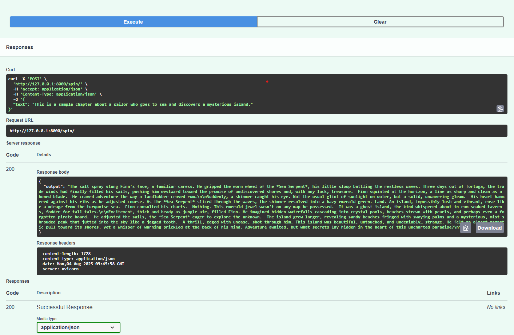

# 📚 Automated Book Publication Workflow 🚀

A fully agentic AI-powered system that:
- Scrapes book chapters from websites 📖
- Rewrites them using generative AI ✍️
- Refines them through AI + human feedback loops 🧠
- Tracks versions using ChromaDB 🔄
- Offers voice agent interaction 🎤
 
> 👨‍💻 Developed using OpenAI/Gemini, FastAPI, ChromaDB, and RL-based scoring

---

## 🌟 Features

✅ **Web Scraping & Screenshot**  
→ Extracts content from book sites and saves high-res screenshots using `Playwright`.

✅ **AI-Powered Chapter Spinning**  
→ Uses GPT-4 or Gemini Pro to rewrite chapters in a modern, engaging tone.

✅ **AI Reviewer with RL-Scoring**  
→ Reviews rewritten text for clarity, tone, and grammar with reward model via sentence similarity.

✅ **Human-in-the-Loop Review**  
→ Manual iterations supported with version control via ChromaDB and semantic search.

✅ **Voice Agent Interface**  
→ Accepts and returns speech using `pyttsx3` and `speech_recognition`.

✅ **FastAPI-Powered Backend**  
→ Run locally or deploy via REST API with `/spin/` endpoint.

---

## 🖼️ UI Preview

| Response | 
|-----------|
|  |

---

## 🛠️ Tech Stack
| Tool | Purpose |
|------|---------|
| Python | Core language |
| FastAPI | API backend |
| Playwright | Web scraping + screenshots |
| ChromaDB | Content versioning & semantic search |
| OpenAI/Gemini | Generative AI (writer & reviewer) |
| Sentence Transformers | Reward scoring (RL-style) |
| pyttsx3 + speech_recognition | Voice interface |
| GitHub | Version control |

---

##🔧 How It Works
This workflow automates rewriting book chapters using AI, with human feedback and version control.
-🌐 Scrape & Snapshot
Playwright extracts text and screenshots from chapter URLs.

-✍️ AI Writing & Review
Text is rewritten using GPT-4 or Gemini Pro, then refined by an AI Reviewer.

-🏆 RL-Based Scoring
Similarity between original and rewritten versions is scored using sentence embeddings.

-🧠 Human-in-the-Loop + Versioning
Multiple review cycles supported. Versions tracked with ChromaDB and searchable semantically.

-🗣️ Voice Interaction + API
Voice input/output supported. FastAPI backend exposes /spin/ endpoint for integration.

---

##🌱 Future Scope & Improvements
-🌐 Web UI: Add a clean frontend using React or Streamlit for better UX.
-🔁 Real RL Training Loop: Replace static reward score with fine-tuning loop.
-🗂️ User Dashboard: Save chapter history, compare versions visually.
-🧠 Human Feedback Ingestion: Allow human feedback to influence next generations.
-🔊 TTS + STT Overhaul: Integrate Whisper or ElevenLabs for more accurate voice I/O.
-☁️ Cloud Deployment: Deploy on AWS/GCP with ChromaDB in Docker + FastAPI backend.

---

## 📁 Folder Structure
Automated_Book_Publication/
│
├── ai_agents/
│   ├── writer.py
│   └── reviewer.py
│
├── api/
│   └── agentic_api.py
│
├── human_in_loop/
│   └── versioning.py
│
├── rl/
│   └── reward.py
│
├── scraping/
│   └── scraper.py
│
├── utils/
│   └── voice_support.py
│
├── .env
├── requirements.txt
